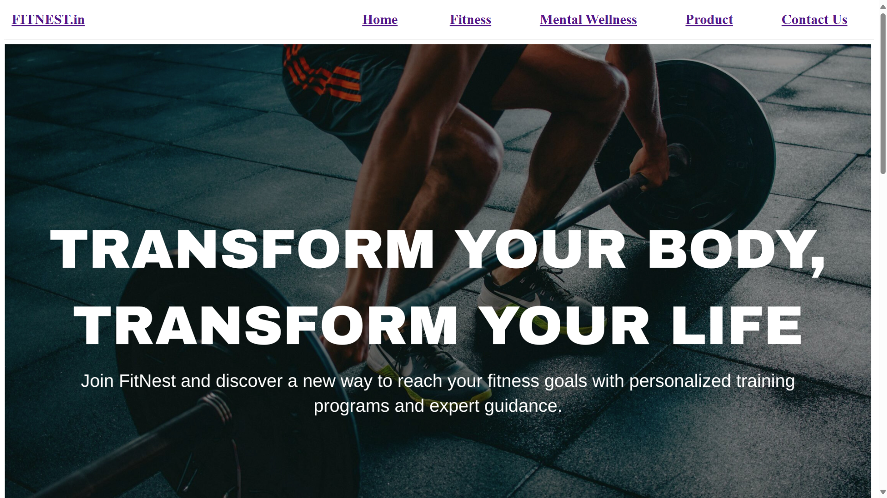
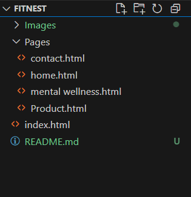

# FitNest.in Website 💪
A modern, responsive website designed to help users achieve their health and fitness goals. The platform provides workout plans, nutrition tips, and community features to support a healthy lifestyle.

## Live Demo 🚀

Click Here To View Live Demo Of The wesite :
[FitNest.in](#)

## Table Of Contents 📌

- Features
- Tech Stack
- Screenshots
- Folder Structure
- Contributions

## Features 🌟

- 🧘‍♂️ Personalized workout plans
- 🍎 Nutrition tracking and diet suggestions
- 👥 Community forum and messaging
- 📱 Responsive design
- 🧠 Educational blog posts on health and fitness

## Tech Stack 🛠

**Front-end :**
- Html5 
  
**Deployments :**
- Netlify
- Vercel
- Onrender
  
## Screenshots 🖼 

### Home Page :

## Folder Structure 📁

## Contributors  🤝

Made with [contrib.rocks](https://contrib.rocks).

